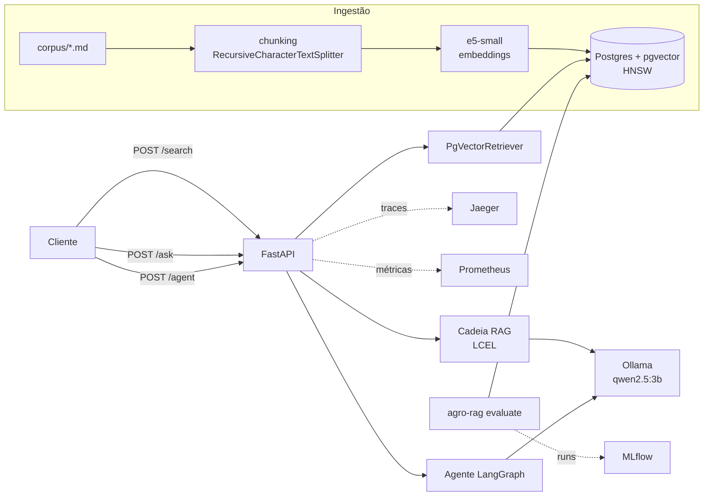
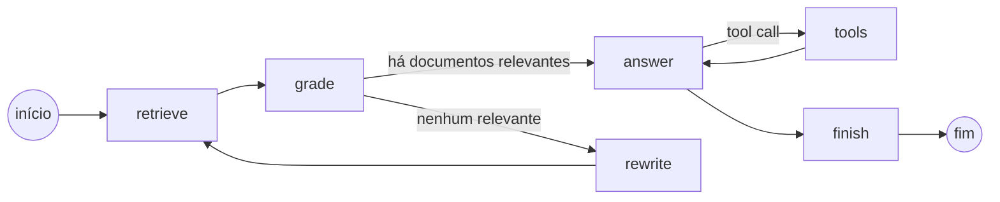

# agro-rag-api

API de RAG (Retrieval-Augmented Generation) para conhecimento agronômico: fertilidade do solo, culturas, pragas, doenças e manejo. Os documentos são indexados no PostgreSQL com pgvector, a busca é semântica com embeddings locais do Hugging Face e as respostas são geradas por um LLM rodando no Ollama, tanto em uma cadeia RAG simples quanto em um agente com LangGraph.

Tudo roda localmente com `docker compose up`, sem chave de API externa.

## Stack

- **API:** Python 3.12, FastAPI, Pydantic v2, uv
- **Banco vetorial:** PostgreSQL 17 + pgvector (índice HNSW, distância de cosseno), SQLAlchemy 2 async + asyncpg, Alembic
- **Embeddings:** `intfloat/multilingual-e5-small` via sentence-transformers (CPU)
- **LLM / orquestração:** LangChain (LCEL, retriever próprio), LangGraph (agente com grading e ferramenta), Ollama com `qwen2.5:3b`
- **Avaliação:** recall@k, MRR e nDCG com numpy, pandas e scikit-learn; experimentos registrados no MLflow
- **Observabilidade:** OpenTelemetry (FastAPI + SQLAlchemy) exportando para Jaeger, logs JSON com structlog, métricas Prometheus
- **Qualidade:** pytest, pytest-asyncio, httpx, cobertura mínima de 85%, ruff, mypy `--strict`, GitHub Actions
- **Carga:** Locust

## Arquitetura



O agente segue o fluxo abaixo. O grader descarta trechos irrelevantes; se nenhum sobrar, a pergunta é reescrita e a busca é repetida uma vez. Na geração, o modelo pode chamar a ferramenta `liming_calculator`, que calcula a necessidade de calagem pelo método da saturação por bases: `NC = (V2 − V1) × CTC / PRNT`.



## Como rodar

Pré-requisitos: Docker e Docker Compose.

```bash
docker compose up -d --wait                 # db, migrate, ollama (+ pull do modelo), api, mlflow, jaeger, prometheus
docker compose run --rm api agro-rag ingest # indexa os 36 documentos do corpus
```

Na primeira execução o compose baixa o `qwen2.5:3b` (~1,9 GB) e o modelo de embeddings (~470 MB, guardado no volume `hf-cache`).

| Serviço | URL |
|---|---|
| API (Swagger) | http://localhost:8000/docs |
| MLflow | http://localhost:5000 |
| Jaeger | http://localhost:16686 |
| Prometheus | http://localhost:9090 |

Variáveis úteis: `OLLAMA_MODEL` (modelo do Ollama), `API_WORKERS` (workers do uvicorn, padrão 4), `API_TORCH_THREADS` (threads do torch por worker, padrão 2). As configurações da aplicação usam o prefixo `AGRO_` (veja `src/agro_rag/config.py`).

## Endpoints

```bash
# Busca semântica (somente retrieval)
curl -s localhost:8000/search -H 'content-type: application/json' \
  -d '{"query": "como controlar a cigarrinha no milho safrinha", "k": 3}'

# RAG: retrieve + geração com citação das fontes
curl -s localhost:8000/ask -H 'content-type: application/json' \
  -d '{"question": "Quando devo aplicar nitrogênio em cobertura no milho?"}'

# Agente LangGraph com grading e ferramenta de calagem
curl -s localhost:8000/agent -H 'content-type: application/json' \
  -d '{"question": "Calcule a necessidade de calagem para um solo com V1 de 35%, V2 de 60%, CTC de 8 cmolc/dm³ e calcário com PRNT de 80%."}'
# steps: ["retrieve:4", "grade:2", "answer", "tools", "answer"]
# answer: "A necessidade de calagem para esse solo é de **2.50 t/ha**."
```

Também existem `GET /health` (verifica o banco) e `GET /metrics` (Prometheus).

## Corpus e avaliação

- `corpus/`: 36 documentos curtos, escritos para este projeto, em quatro categorias (`solo`, `culturas`, `fitossanidade`, `manejo`).
- `eval/questions.jsonl`: 72 perguntas (duas por documento), escritas com vocabulário diferente do texto e rotuladas com os documentos relevantes.

`agro-rag evaluate` indexa o corpus em uma coleção por configuração, roda todas as perguntas, deduplica os chunks por documento e calcula recall@k, hit@k, nDCG@k, MRR e a latência do retrieval. Cada configuração vira um run no MLflow, com parâmetros, métricas e o CSV por pergunta como artefato.

## Testes e qualidade

Os testes rodam sem rede: usam `HashingEmbeddings` (feature hashing determinístico) e `DeterministicChatModel`, um chat model do LangChain que responde a partir do contexto, simula o grader e emite a chamada de ferramenta. O banco é um Postgres com pgvector de verdade.

```bash
docker compose --profile test build
docker compose --profile test run --rm tests   # pytest + cobertura (mínimo 85%)

# ou no host, com o banco do compose em localhost:5433
uv sync
uv run ruff check . && uv run ruff format --check . && uv run mypy src tests
uv run pytest
```

A CI (GitHub Actions) roda lint e tipos, os testes com um serviço Postgres/pgvector, e o build das imagens Docker, executando os testes dentro da imagem e um smoke test de `/health`, `/search` e `/ask` via compose.

## Resultados

Medições feitas localmente em 27/09/2026, com a stack rodando no Docker Compose.

**Máquina:** Intel Core i7-10700 @ 2,90 GHz (8 núcleos / 16 threads), 31 GiB de RAM, Linux 7.1. Tudo em CPU (a GPU não foi usada pelos containers).

### Qualidade do retrieval

72 perguntas, overlap de 50 caracteres, métricas por documento.

```bash
docker compose run --rm -e AGRO_EMBEDDING_MODEL=sentence-transformers/paraphrase-multilingual-MiniLM-L12-v2 \
  api agro-rag evaluate --chunk-sizes 300,500,800 --overlaps 50
docker compose run --rm api agro-rag evaluate --chunk-sizes 300,500,800 --overlaps 50
```

| Modelo de embeddings | Chunk | Chunks | Recall@1 | Recall@3 | Recall@5 | Recall@10 | nDCG@5 | MRR |
|---|---:|---:|---:|---:|---:|---:|---:|---:|
| paraphrase-multilingual-MiniLM-L12-v2 | 300 | 173 | 0,660 | 0,875 | 0,910 | 0,951 | 0,817 | 0,805 |
| paraphrase-multilingual-MiniLM-L12-v2 | 500 | 99 | 0,618 | 0,764 | 0,861 | 0,951 | 0,759 | 0,752 |
| paraphrase-multilingual-MiniLM-L12-v2 | 800 | 71 | 0,528 | 0,729 | 0,778 | 0,903 | 0,677 | 0,672 |
| **multilingual-e5-small** | 300 | 173 | 0,924 | 0,979 | 0,979 | 1,000 | 0,973 | 0,974 |
| **multilingual-e5-small** | **500** | 99 | **0,931** | **0,979** | **0,979** | 0,993 | **0,976** | **0,981** |
| **multilingual-e5-small** | 800 | 71 | 0,889 | 0,965 | 0,979 | 1,000 | 0,958 | 0,956 |

A troca de modelo foi o que mais pesou: com chunks de 500, o MRR subiu de 0,752 para 0,981 e o recall@1 de 0,618 para 0,931. Chunks de 500 caracteres com o e5-small viraram o padrão.

### Carga no `/search` (somente retrieval, sem LLM)

API com 4 workers do uvicorn e `OMP_NUM_THREADS=2`; Locust com espera de 0,1 a 0,5 s entre requisições, rodando na mesma máquina.

```bash
docker compose --profile load build
docker compose --profile load run --rm locust                                    # 50 usuários, 2 min
LOCUST_USERS=100 LOCUST_SPAWN_RATE=20 docker compose --profile load run --rm locust # 100 usuários, 2 min
```

| Usuários | Requisições | Falhas | Throughput | p50 | p95 | p99 |
|---:|---:|---:|---:|---:|---:|---:|
| 50 | 13.165 | 0 | 109,97 req/s | 110 ms | 380 ms | 650 ms |
| 100 | 11.479 | 0 | 95,86 req/s | 730 ms | 1.100 ms | 1.400 ms |

Com 100 usuários a API já está saturada (~100 req/s): o throughput não sobe e a latência cresce por fila. O gargalo é o encoding da pergunta na CPU. Antes de habilitar múltiplos workers, com um único processo, o mesmo teste de 50 usuários ficava em 41,62 req/s com mediana de 860 ms.

### Latência com LLM (Ollama em CPU, `qwen2.5:3b`)

Amostra pequena, apenas para ordem de grandeza: 5 perguntas no `/ask` e 4 no `/agent`, sequenciais.

| Endpoint | Mediana | Faixa |
|---|---:|---:|
| `/ask` | 18,6 s | 14,3 a 24,1 s |
| `/agent` | 32,9 s | 24,5 a 37,1 s |

O agente faz uma chamada ao LLM para cada trecho recuperado (grading) antes de responder, por isso custa quase o dobro. Com modelos de 3B em CPU o grader também é conservador: em uma das quatro perguntas ele descartou todos os trechos e o agente respondeu que não encontrou a informação.

### Testes

51 testes, cobertura de 98% (`docker compose --profile test run --rm tests`).

## Estrutura

```
src/agro_rag/
  api/            rotas, schemas e dependências do FastAPI
  db/             modelos SQLAlchemy, sessão async e migrações Alembic
  ingestion/      loader de Markdown, chunking e pipeline de ingestão
  evaluation/     métricas de ranking e runner com MLflow
  embeddings.py   sentence-transformers e embeddings determinísticos para testes
  retrieval.py    busca no pgvector e retriever do LangChain
  rag.py          cadeia RAG (LCEL)
  agent.py        agente LangGraph
  tools.py        ferramenta de cálculo de calagem
  llm.py          Ollama e chat model determinístico
  observability.py
corpus/           base de conhecimento
eval/             perguntas rotuladas
loadtest/         cenário do Locust
```

## Licença

MIT. O conteúdo de `corpus/` é original e tem finalidade didática; não substitui recomendação de um engenheiro agrônomo.
